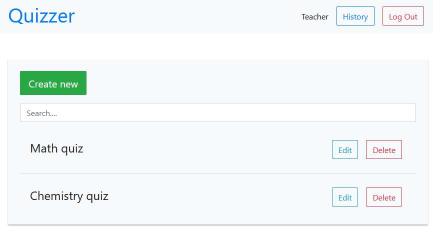

# Quizzer

Simple web application on Flask that allows you to create, edit and solve quizzes

## Installation
From Python:
1) Download source code
2) `pip install .`

From Docker:
1) `docker pull tmarenko/quizzer`

## Usage
From Python:
1) `pip install waitress`
2) `waitress-serve --call 'quizzer:create_app'`

From Docker:
1) `docker run -p 5000:5000 tmarenko/quizzer`

## Sharing database
1) Use `-v` parameter while running docker: 

    `docker run -p 5000:5000 -v "%CD%/instance:/app/instance" tmarenko/quizzer`